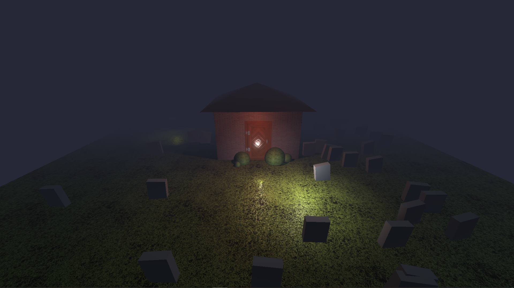

# HAUNTED HOUSE

I made an elementary house composed of walls, a roof, a door, and some bushes. I also added graves in the garden. Instead of visible ghosts made of sheets, I simply use multicolor lights floating around and passing through the walls and the floor.

Exercice from [threejs-journey](https://threejs-journey.xyz/) by [Bruno Simon](https://github.com/brunosimon) to learn [three.js](https://threejs.org/)

In the project directory, you can run:

### `yarn install`

Then the following command

### `yarn run dev`

Runs the app in the development mode.\
Open [http://localhost:8080](http://localhost:8080) to view it in the browser.

